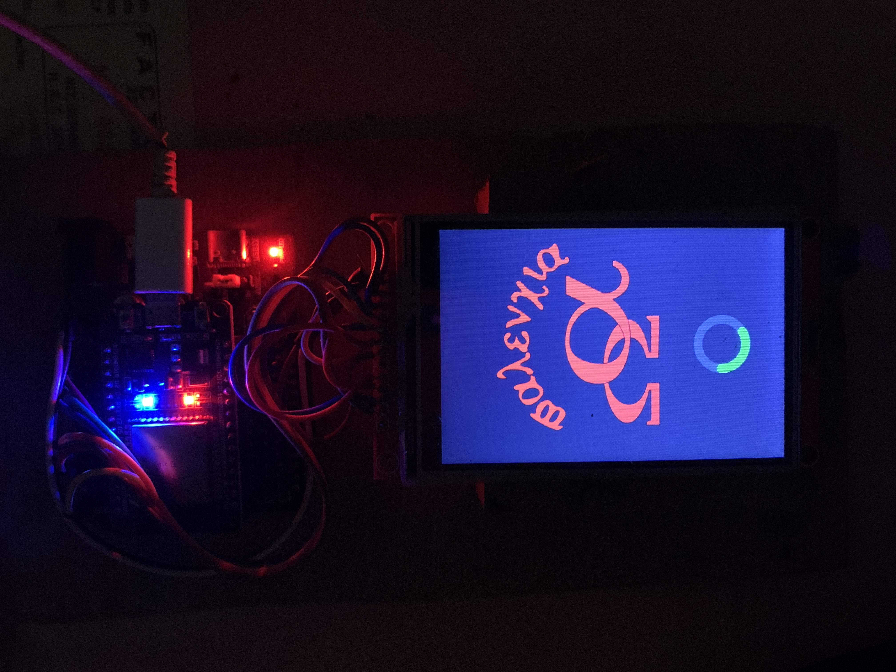
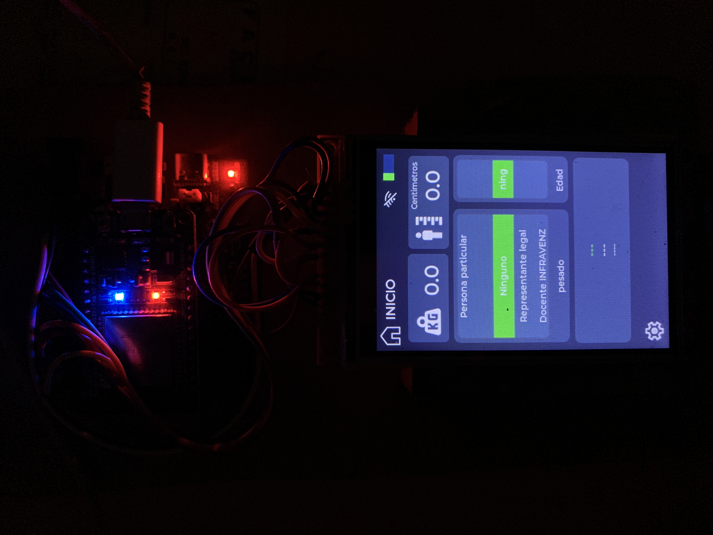
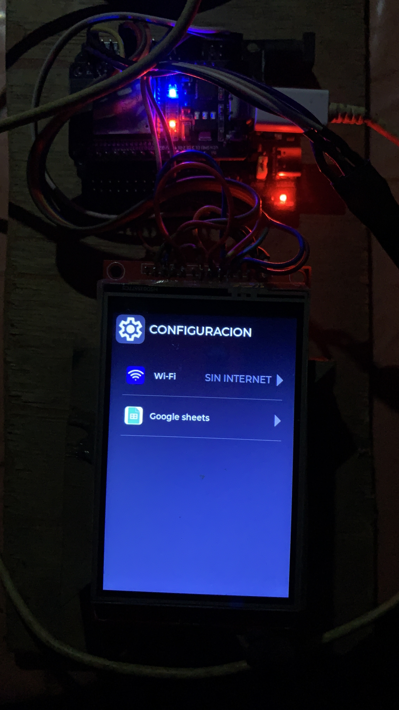
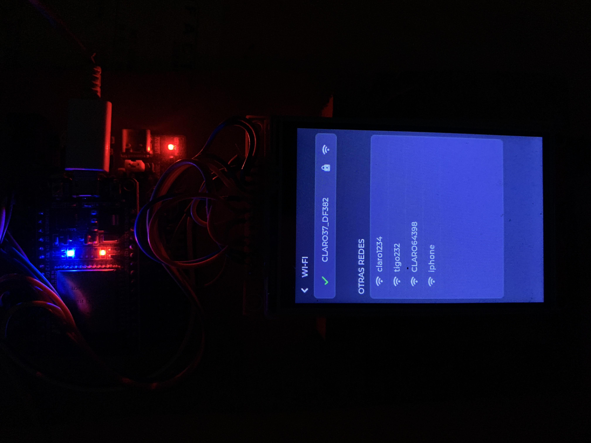

# ESPIMC
 ``` verion 3.1.1 ```

**Descriccion de el proyecto**
recoje datos sobre el peso de una persona en libras con una bascula digital y los muestra en una pantalla TFT


**caracteristicas**
usa un convertidor analogico digital ``` HX711 ```
Un microcontrolardor ESP32 DEVKIT V1 para manejar los datos. 

**piezas**
- ESP32 DEVKIT V1
- HX711
- 4 Celdas de carga de 50KG
- Pantalla TFT 320x480 ILI9488   

**Librerias**
- HX711
- TFT_eSPI
- LVGL 
> la version de la libreria LVGL debe de ser igual a 9.1

---
# diseño de las pantallas
Diseño de la UI de la pantalla. Esta creada con la herramienta square line studio utilizando la libreria LVGL. hay pequeñas modificaciones de la UI en el codigo de modo de prueba como es la implementacion de la ``` message box ``` y en el widget estatico donde esta para elegir la red WI-FI a conectar, En la pantalla de configuracion de WI-Fi.







# mejoras
- Se puso en funcionamiento la pantalla para mostrar los datos provinientes de el HX711
- se calibro la bascula para medir en kilogramos pero se transfomaran mediante una ecuacion a libras.
- Las conecciones de la placa a la pantalla se hicieron soldadas. 
- se agrego codigo externo de la documentacion de LVGL para agregar message box y un textarea.


# problemas
- no se puede agregar modulo wifi, por falta de memoria DRAM
